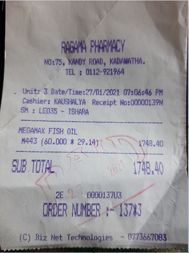

# DataScience Hackathon 2021 

## Problem Statement 
Accurately recognizing the total bill amount from scanned bills/inovice images.

## Background 
### Use Case 1: Financial and Account Systems 
Modern Financial Accounting Systems can save a lot of manual labor and discrepancies which occur due to manually entering data from printed invoices and receipts
It will help to drastically speed up the supply chain processes as well.

#### Medical Bill Reimbursements

Accounts department receives diverse types of invoices for claims. Scanning through excessive amounts of invoices take up a lot of time of employees. The bills are received as PDFs and various image types. The accounts department is thinking about freeing up employee hours by automating the process of calculating total amount of the given set of bills. An example use case is given below.

#### Calculating petty cash requirements and payables of organisations

Petty cash are minor expenses incurred in organisations/teams when conducting their regular day-to-day work (e.g.: buying a marker, short eats etc.). These are done via bills, which need to be manually calculated by accountants and process for final payments at the end of the month. This system can categorise these bills and identify the types of payments incurred, whether the allocated budget is overused by a team and much more. This eliminates the manual process of reading bills and calculating the final payable amount.


### Use Case 2: Personal expences tracking applications
Mobile applications helping to manage personal expenses are becomeing popular, most of them support the functionality of scanning the bills/invoices and updating them in the accounts management software automaitcally.


## Data Set
Data set included for this taks consists of 650 scanned bills / invovices in PNG format, all of them  labeled with the final total value of each bill.

#### Sample invoice



#### Sample prediction
* sample_invoice.json
    ```
    {"total": "1748.40"}
    ```
    Or
* All result in a single file
    ```
    {
        "file_name"
    }
    ```

## Expected Solution
#### Functional Requirement 

An employee in the accounts department should be able to upload/submit a set of images consisting of invoices and get the total value of submitted invoices. (Developing upload/submit functionality is not a must. Copying a set of images to a source directory is acceptable). 

**We are expecting existing OCR image-to-text extraction methods and implementations, to be re-used to extract the features from the images**

Eg: 

[Tesseract OCR](https://github.com/tesseract-ocr/tesseract)

[AWS Public API](https://aws.amazon.com/blogs/machine-learning/automatically-extract-text-and-structured-data-from-documents-with-amazon-textract)


[Azure](https://azure.microsoft.com/en-gb/services/form-recognizer/#features)
    
After extracting features from the images we are expecting a machine learning model to predict the total amount of the bill.

#### Task 
Build a machine learning model to process a given set of images of invoices and extract the Total amount of each invoice separately. 

#####
As a pre-processing step you are expected to overcome following challenges in the data set
* Images are not in the same resolution
* Images will have different orientations and sizes
* Some images could be partially damaged or might have poor ink quality

With pre-processing, its expected **that existing OCR image to text extraction methods and implementations to be re-used to extract the features from the images** and generate the input to the task of extracting total amount from the bill.

Apply the trained model on a validation dataset and produce and present the results.


#### Presentation {TODO}

* Methods used for pre-processing data 

* The Model/s used 

* Evaluation metrices : eg : F1 scores , confusion metrix

* Result from validation dataset


#### Output 

Output should be in the following format as a CSV saved to output file. Output should be logged to console in following format (No need to draw a table. Output should be well formatted).  

|File name|total|
|:---:|:---:|
|Invoice_1.jpg|32| 
|Invoice_2.jpeg|97|
| *Grand Total* |129| 

## Evaluation Criteria 

* All teams should submit a working application that satisfies the functional and technical requirements.  

* A new set of files (excluding training set) will be used to evaluate the prediction accuracy.

* Re-usability of this model on a general scanned bill/invioce image will be evaluated. 
